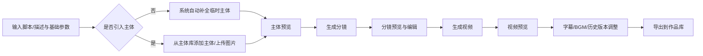
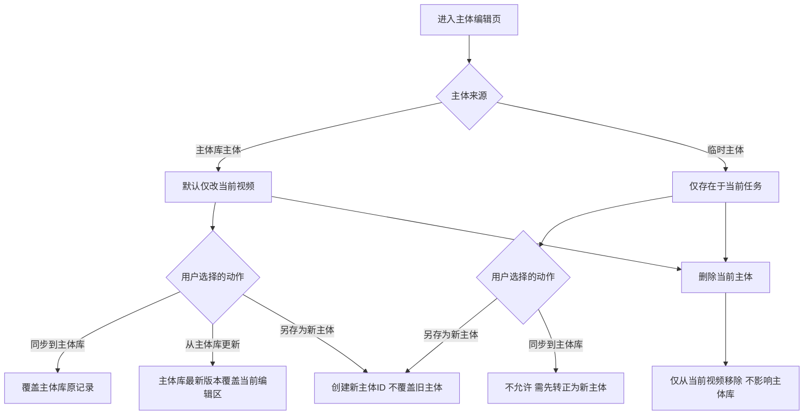
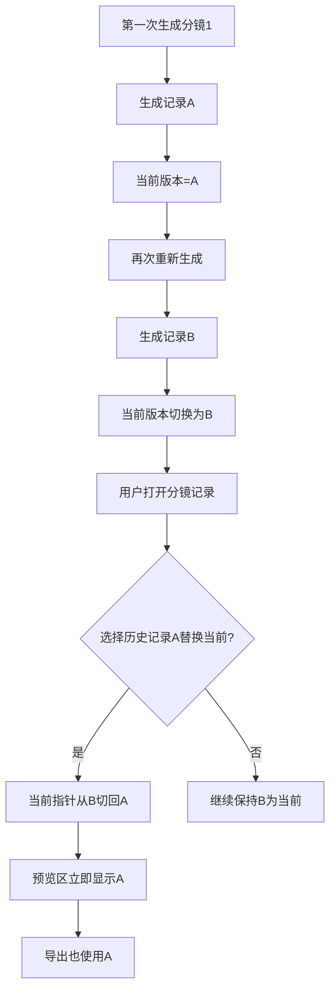
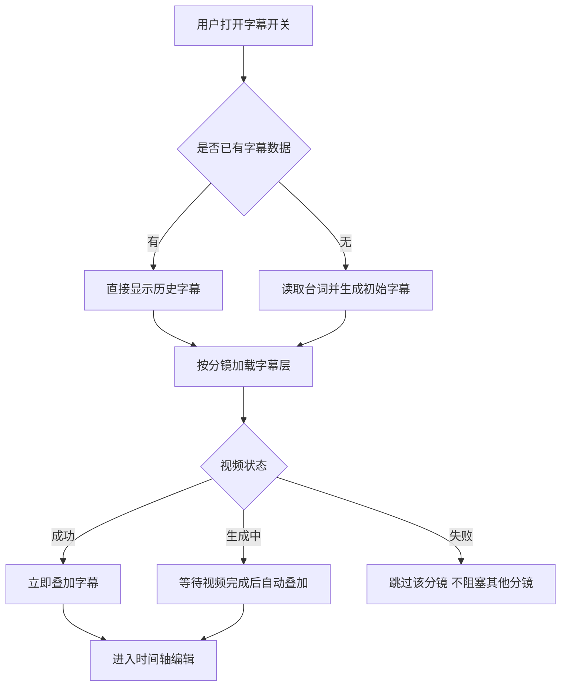

# 核心逻辑_AIGC创作流

## 一、文档边界

- 证据来源：
  - `迭代1-迭代6` 的编号页原型，重点参考 `创作工作流`、`主体预览/主体资产指令`、`分镜预览`、`分镜生成记录`、`字幕`、`背景音乐自定义上传` 等页面。
  - `【AI漫剧】使用文档.pdf`，重点参考第 2-6 页、第 15-21 页。
- 提取口径：
  - 只提取可见文字、业务逻辑、页面标注、流程说明。
  - 不推断代码实现。
- 口径优先级：
  - 当前标准链路以 PDF 为主。
  - 原型页用于补足更细的交互规则、边界条件和历史设计说明。

## 二、AIGC 创作主链路

### 2.1 当前标准链路

当前产品的主生成链路，已经从 `脚本预览 -> 分镜预览 -> 视频预览` 的早期三段式，演进为更强调主体一致性控制的链路：`脚本/描述输入 -> 主体预览 -> 分镜编辑 -> 视频预览 -> 导出`。  
其中，脚本理解仍然存在，但更多被前置到输入后和主体预览前后的自动处理中。

### 2.2 脚本/提示词输入阶段

#### 业务规则

- 用户先输入视频内容描述，早期原型明确要求：
  - 输入为空时，生成按钮禁用，并提示“请输入视频内容”。
  - 文本最长 `1000` 字，超出提示“内容有点多哦，请精简后再试一次。”
  - 支持自动保存上次输入内容。
- 输入页同时承载全局生成参数：
  - 风格
  - 视频总时长
  - 视频比例
  - 分辨率
  - 迭代 6 进一步加入模型选择、单分镜模式、图片/主体混合输入。
- 早期逻辑里，“视频总时长”会影响系统拆分出的分镜数量；到后续版本，又进一步支持对单个分镜时长进行单独调整。
- 输入阶段已支持把主体加入当前任务：
  - 入口在 Prompt 输入框左下角的 `+ 添加主体`
  - 从主体库选择后，先进入当前任务的“主体框”，再参与后续引用和生成。

#### 接口层最新补充

- 最新 `animatic/create_asset` 已把 `gen_mode` 提升为必传：
  - `0` 长视频生成模式
  - `1` 九宫格模式
- 同一接口里，视频生成模型与九宫格图片模型已经拆开：
  - `model`：视频生成模型，默认 `viduq2`
  - `nine_grid_img_model`：九宫格图片生成模型，默认 `gemini-3.1-flash-image-preview`
- 最新接口表还新增：
  - `character_uids`：主体库 uid 数组
  - `upload_image_urls`：九宫格模式上传图片 url 字典，按主体 uid 组织
- 最新接口表把 `character_uids` 标记为必传，但是否允许空数组未展开说明，现阶段记为 `必传/可传空数组待确认`。
- 这说明输入阶段已经不是单纯“写一段描述”，而是先完成模式声明、模型声明、主体绑定和参考图挂接。

#### 关键结论

- 这一阶段不只是“写脚本”，而是在做全局创作约束设定。
- 后续所有分镜、视频生成、字幕和历史记录，都会继承这里的全局上下文。

#### 来源依据

- `迭代1/2、创作工作流.html`
- `迭代2/3、主体资产指令.html`
- `迭代6/2、九宫格功能.html`
- `【AI漫剧】使用文档.pdf` 第 2 页

### 2.3 主体预览阶段

#### 核心目标

- 在正式生成分镜前，先把角色、物品、场景的主体信息确认下来。
- 把“当前视频要用什么主体”与“主体库里长期沉淀什么主体”分开处理。

#### 主体类型

- 当前材料里，主体至少区分为：
  - 主体库角色
  - 临时角色
  - 主体库场景
  - 临时场景
  - 主体库物品
- PDF 也明确区分：
  - 系统自动补充出的临时主体
  - 第一步中用户选中的主体库主体

#### 当前页编辑规则

- 用户可以在主体预览页对主体进行编辑、新增、删减。
- 对主体库主体的当前页修改，默认只对当前视频生效，不自动写回主体库。
- 页面提供显式同步入口：
  - `修改同步更新至主体库`
  - `同步到主体库`
  - `从主体库更新`
  - `另存为新角色/另存为新主体`
- 删除主体时：
  - 只从当前视频任务中移除
  - 不影响主体库中的原始数据

#### 输出结果

- 用户确认主体后，点击 `生成分镜` 进入下一步。

#### 来源依据

- `迭代2/4、主体预览页.html`
- `【AI漫剧】使用文档.pdf` 第 3 页

### 2.4 分镜预览与编辑阶段

#### 当前标准口径

- PDF 当前口径：每个分镜支持编辑
  - 脚本内容
  - 镜头描述
  - 单个分镜的视频时长
- 原型页补充了更细的结构：
  - 每个分镜卡片展示 `脚本内容 + 镜头描述 + 台词 + 首帧/主体图`
  - 分镜编辑弹窗支持修改
    - 镜头描述
    - 角色台词
    - 镜头设计
    - 首帧图或主体图
    - 分镜时长

#### 主体在分镜阶段的表现

- 分镜列表中的脚本内容，需要把 `@` 引用的主体显式展示出来，并与普通文本区分。
- 分镜阶段的镜头描述，同样支持引用创作入口页加入的主体库主体，范围包含：
  - 角色
  - 物品
  - 场景
- 编辑分镜时，右侧主体列表展示该分镜已绑定的主体。
- 若用户在分镜描述里添加或删减主体，主体列表需要同步增减。

#### 时长控制

- 分镜默认由算法给出建议时长。
- 用户可以在分镜阶段单独调整分镜时长。
- 这意味着平台已从“总时长驱动分镜数”的粗粒度控制，演进到“单分镜时长可控”的精细控制。

#### 输出结果

- 用户点击 `生成视频`，从分镜级编辑进入视频级预览与合成阶段。

#### 接口层最新补充

- `animatic/insert_shot` 已新增 `character_uids` 和 `model` 入参，说明插入分镜时也能带主体与模型上下文。
- `animatic/update_all_shots` 最新表里明确的更新字段收敛为 `duration`、`ratio`、`quality`、`model`，并要求同时带 `steps_gen_status` 与 `assets_uid`。
- 最新 `animatic/get_shots_by_asset` 除分镜列表外，还返回资产级 `bgm`、`volume`，以及分镜级 `provider`、`gen_mode`、`model`，说明分镜查询已经兼顾成片配置和模型执行态。

#### 来源依据

- `迭代2/5、分镜预览.html`
- `迭代4/4、分镜预览.html`
- `【AI漫剧】使用文档.pdf` 第 4 页

### 2.5 视频预览阶段

#### 核心作用

- 视频预览页是最终合成与校对页。
- 这一页承接的是“分镜集合”，不是单一镜头。

#### 主要能力

- 左侧查看分镜列表，可逐条切换分镜内容。
- 右侧配置背景音乐，支持试听。
- 所有分镜生成完成后，可切换为完整视频一键播放。
- 点击导出后，视频保存到作品库。

#### 早期时间轴能力

- 早期原型已定义视频预览页可对分镜执行：
  - 编辑
  - 添加
  - 删除
  - 自动重新拼接
- 这说明视频预览页不是纯“播放页”，而是最终成片编排页。

#### 来源依据

- `迭代1/2、创作工作流.html`
- `【AI漫剧】使用文档.pdf` 第 5-7 页

## 三、一致性控制逻辑

### 3.1 `@主体` 引用逻辑

#### 触发与范围

- 只有已经加入当前任务“主体框”的主体，才能被 `@` 引用。
- 用户在输入框内输入 `@` 时，触发下拉主体列表。

#### 下拉列表规则

- 只展示“主体框”内的主体。
- 展示顺序严格按照主体框中的顺序排列。
- 列表展示主体名称即可。

#### 选择规则

- 支持鼠标点击选择。
- 支持键盘上下选择，回车确认。
- 引用后的主体文本需要和普通文本视觉区分。
- 支持主体引用和普通文本混合输入。

#### 展示规则

- 示例结果为：`[林克] 拿了一把 [剑]，跑进了 [森林] 里。`
- 若主体名称过长，输入框内需要省略显示，例如 `超级无敌...战士`。
- 到分镜页后，这些 `@` 引用仍需被清晰展示，并与普通脚本内容区分。

#### 业务意义

- `@主体` 不是简单文本语法，而是“把结构化主体资产嵌入自然语言提示词”的桥梁。
- 它让平台从纯 Prompt 生成，升级为“结构化主体 + Prompt”的生成方式。

#### 来源依据

- `迭代2/3、主体资产指令.html`
- `迭代2/5、分镜预览.html`

### 3.2 主体同步、覆盖与版本来源规则

#### 规则总述

- 平台把“当前视频编辑态”和“主体库长期资产态”明确拆开。
- 当前页编辑默认只影响当前视频，不默认改库。

#### 具体动作定义

- `同步到主体库`
  - 含义：把当前编辑后的主体信息同步回主体库。
  - 结果：覆盖主体库中对应主体的现有内容。
  - 成功反馈：Toast 提示“已同步到主体库”或“已更新至主体库”。
- `从主体库更新`
  - 含义：读取主体库中的最新版本。
  - 结果：主体库信息覆盖当前编辑区。
  - 成功反馈：Toast 提示“已更新当前角色信息”或“已获取主体库的最新角色版本”。
- `另存为新主体`
  - 含义：把当前主体另存为新条目。
  - 结果：新建唯一 ID，不影响旧主体。
  - 限制：若用户主体库达到上限，则不能继续新建。
- `临时主体`
  - 只能 `另存为新主体`
  - 不能直接覆盖已有主体库主体

#### 一致性控制含义

- 这套机制本质上是在解决两个冲突：
  - 当前视频需要临时改造主体
  - 资产库又要保持长期稳定
- 平台因此提供三种不同的写入语义：
  - 只改当前视频
  - 覆盖库内原主体
  - 派生出一个新主体

#### 来源依据

- `迭代2/4、主体预览页.html`
- `【AI漫剧】使用文档.pdf` 第 3 页

### 3.3 Seed 值控制

#### 当前结论

- 现有原型与 PDF 中，没有找到显式的 `Seed / 随机种子 / 种子值` 规则。
- 也没有发现以下任一用户可见机制：
  - Seed 展示
  - Seed 回填
  - Seed 锁定
  - Seed 复用
  - Seed 复制到重生成

#### 可确认的相邻能力

- 原型里出现过 `AI随机生成` 的主体创建方式，但这只是主体生成方式，不等同于 Seed 控制。
- 当前材料中，平台真正用于提高确定性的手段是：
  - 主体库
  - `@主体` 引用
  - 主体同步/从库更新
  - 分镜历史记录回滚
  - 单分镜模式下的模型切换、九宫格微调

#### 结论

- 现阶段不能把 Seed 写成平台对外可见规则。
- 如果后续要补 Seed 能力，应被定义为新增能力，而不是“已有能力未文档化”。

## 四、编辑与回滚规则

### 4.1 分镜历史记录与“当前版本指针”

#### 核心定义

- 每个分镜都存在一个历史记录池，保存该分镜历次生成的视频结果。
- 但同一时间，只能有一个 `当前分镜视频`。
- 预览、播放、导出，永远读取当前指针指向的那一条。

#### 明确规则

- 第一次生成：记录 A，当前 = A。
- 第二次生成：记录 B，当前 = B，A 保留在历史里。
- 当用户点击“替换当前分镜视频/使用该版本”时：
  - 本质是切换当前指针
  - 不是删除旧版本
  - 旧版本仍留在历史记录池内
- 替换成功后：
  - 左侧分镜列表自动定位并选中对应分镜
  - 新选中的历史记录变成“当前使用”
  - 原先当前视频取消“当前使用”标签，回到普通历史记录状态
- 当用户重新生成分镜时：
  - 最新生成的视频自动插入该分镜历史列表第一位
  - 新卡片自动进入当前使用态

#### 分镜增删对历史记录的影响

- 新增分镜时：
  - 左侧分镜序号整体后移
  - 右侧历史记录标题和记录标签必须即时重命名
- 删除分镜时：
  - 右侧历史记录也要自动补位

#### 业务本质

- 这套逻辑不是“覆盖式编辑”，而是“版本池 + 当前指针”。
- 平台通过这种方式降低 AIGC 生成的不确定性风险，让用户可以回滚到更满意的版本。

#### 单分镜详情接口补充

- 最新接口表新增 `animatic/get_shot_by_id`，可直接按 `shot_uid` 查询单条分镜详情。
- 返回体除当前分镜基本信息外，还补齐：
  - `his_version`：历史版本集合
  - `subtitle`：字幕数组
  - `generate_method`：生成方式标记
  - `provider`、`model`、`nine_grid_img_model`：当前视频/九宫格所用模型链路
  - `title`、`style_name`、`gen_mode`：回带所属资产的关键信息
- 这意味着“分镜历史记录池”已经不只是页面逻辑，而是有明确的单分镜查询接口支撑。

#### 来源依据

- `迭代3/7、分镜生成记录.html`
- `【AI漫剧】使用文档.pdf` 第 17-18 页

### 4.2 字幕系统与时间轴编辑

#### 总开关逻辑

- 字幕入口位于字幕工具栏下方，使用 switch 开关。
- 开启时：
  - 若当前没有字幕数据，则触发加载/生成
  - 若历史已识别过字幕数据，则直接显示
  - 对所有分镜全量加载字幕
- 不同视频状态下的字幕处理：
  - 视频生成成功：直接叠加字幕层
  - 视频生成中：字幕层等待，视频完成后自动叠加
  - 视频生成失败：跳过该分镜字幕，不阻塞其他分镜
- 关闭时：
  - 隐藏字幕层
  - 样式区、内容编辑区置灰或展示占位文案

#### 历史视频切换时的字幕规则

- 当用户切换某分镜的底层视频版本时，字幕内容保持不变。
- 字幕层始终悬浮在当前显示的视频之上。
- 也就是说，字幕跟随的是“分镜文本语义”，不是某一条底层视频版本。

#### 样式编辑规则

- 支持编辑：
  - 字体
  - 字号
  - 文本颜色
  - 字幕位置
- 修改任意样式后，播放器内实时更新，无需保存。
- 样式修改对当前视频的所有分镜全局生效。
- 位置坐标采用画布中心 `(0,0)`：
  - X 增大，向右移动
  - Y 增大，向下移动

#### 时间轴交互规则

- 选中字幕：
  - 点击灰色字幕块后进入选中态
  - 光标跳到对应时间
  - 删除按钮可用
- 调整时长：
  - 拖左边缘修改起始时间
  - 拖右边缘修改结束时间
- 移动位置：
  - 拖动中间区域整体平移字幕块
- 添加字幕：
  - 点击 `+`
  - 系统查找当前光标右侧第一个足够大的空隙
  - 若空隙 `> 0.5s`，插入一条新字幕
  - 若没有空位，Toast 提示“当前位置无空间添加字幕，请先调整现有字幕”
  - 新字幕默认填满空隙，最长默认不超过 `3s`
- 删除字幕：
  - 只有存在选中字幕时才可删除

#### 硬限制

- 单条字幕最短不能小于 `0.5s`
- 不能与其他字幕块重叠
- 不能超出视频总时长边界
- 视频生成中时间轴不可操作，只显示 loading 骨架
- 若切换到底层更短的视频版本，超出新时长范围的字幕需要被截断

#### 来源依据

- `迭代5/2、字幕.html`
- `【AI漫剧】使用文档.pdf` 第 15-16 页

### 4.3 自定义 BGM 上传规则

#### 文件限制

- 仅支持 `mp3`
- 时长最少 `10 秒`
- 时长最长 `5 分钟`
- 文件大小不超过 `20MB`

#### 上传后状态

- 上传成功后：
  - 按钮态切换
  - 展示文件名和 `.mp3` 后缀
- 点击删除图标：
  - 清除当前上传文件
  - 页面恢复到“上传背景音乐”初始状态

#### 与公共库音乐的互斥关系

- 上传覆盖库音乐：
  - 若用户先选中公共库音乐，再上传本地音乐
  - 上传成功后自动取消公共库音乐勾选
  - 以上传文件为准
- 库音乐覆盖上传：
  - 若用户先上传本地音乐，再点击公共库音乐
  - 系统将已上传本地文件置灰
  - 用户可再次点击上传模块切换回来

#### 导出合成规则

- 导出时，算法读取用户上传的音频文件，并将其作为唯一背景音轨与生成视频进行合成。

#### 来源依据

- `迭代5/8、背景音乐自定义上传.html`
- `【AI漫剧】使用文档.pdf` 第 14 页更新摘要

### 4.4 单分镜模式的最终视频链路

#### 最新补充

- 最新接口表已经补齐 `nine_grid/video/generate` 与 `nine_grid/video/query`：
  - `generate`：创建九宫格最终视频任务
  - `query`：按 `shot_uid` 查询任务状态与最终视频地址
- 审核宽松链路另补充：
  - `nine_grid/multi_model_video`
  - `nine_grid/get_multi_model_video_results`
- 这说明单分镜模式已经形成 `创建资产 -> 九宫格图片 -> 九宫格微调 -> 最终视频任务 -> 查询结果` 的完整接口闭环，而不是只停留在九宫格出图阶段。

#### 状态与异常承载

- 当前最新接口表统一保留 `code` + `msg` 作为接口层返回。
- 任务执行层则更多依赖：
  - `status`
  - `generate_status`
  - `raw_status`
  - `error` / `error_data`
- 具体异常码枚举在最新接口表中没有完整展开，因此本轮文档只同步字段语义，不自行臆造枚举值。

## 五、结论

- AI 漫剧平台的创作主链路，已经不再是简单的 `Prompt -> 视频`。
- 当前真正的底层控制逻辑，是 `结构化主体 -> 分镜级编辑 -> 当前版本指针 -> 成片级校对`。
- 平台的一致性能力，目前主要建立在：
  - 主体库
  - `@主体`
  - 主体同步/覆盖/另存
  - 分镜历史记录回滚
  - 字幕和 BGM 的成片级可编辑能力
- 现有材料不支持把 Seed 作为正式对外规则描述。
