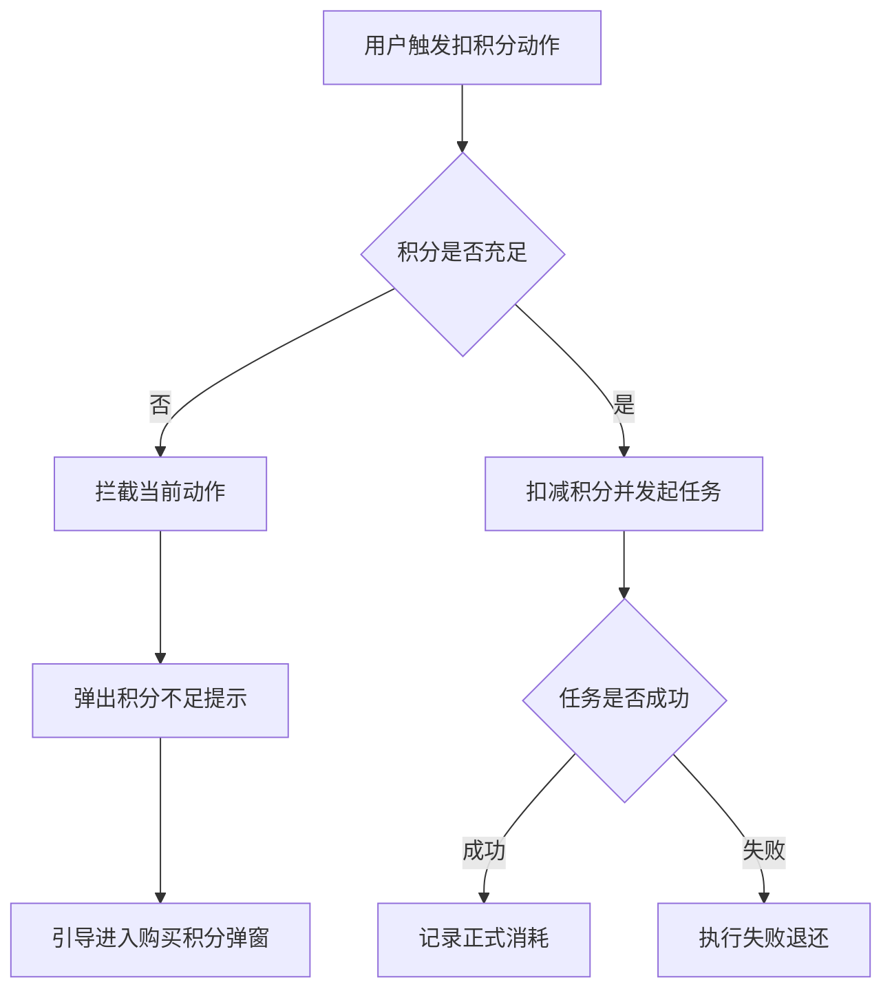
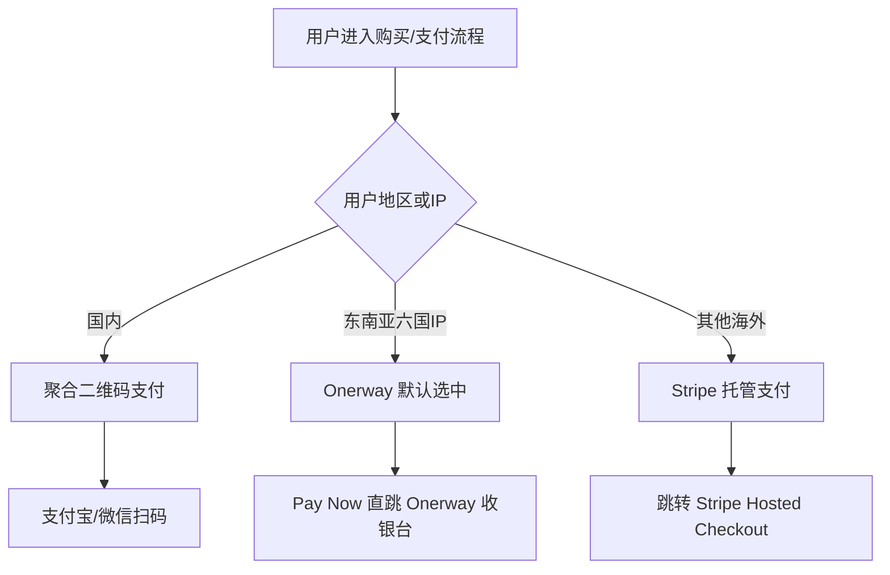
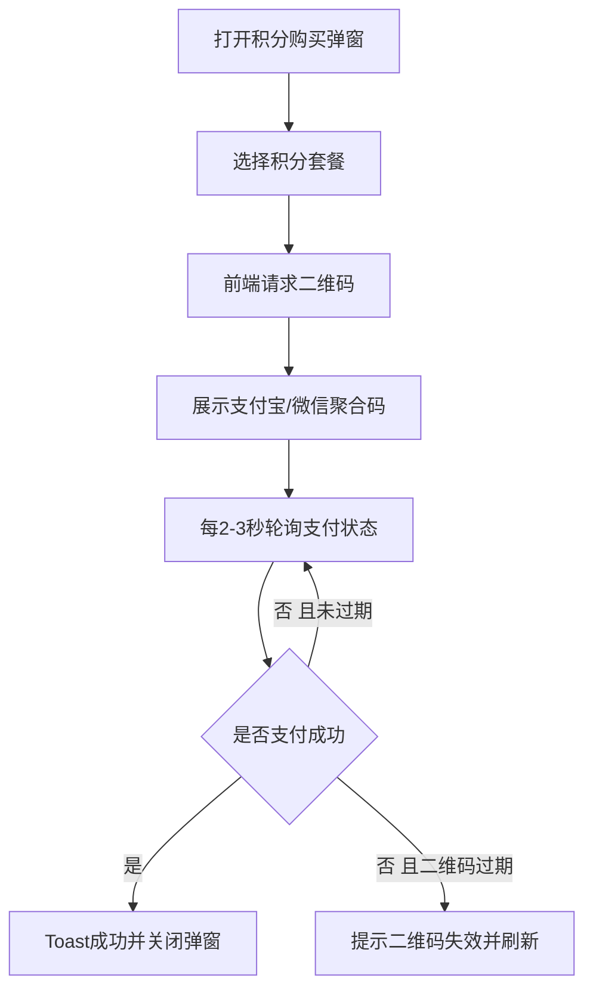
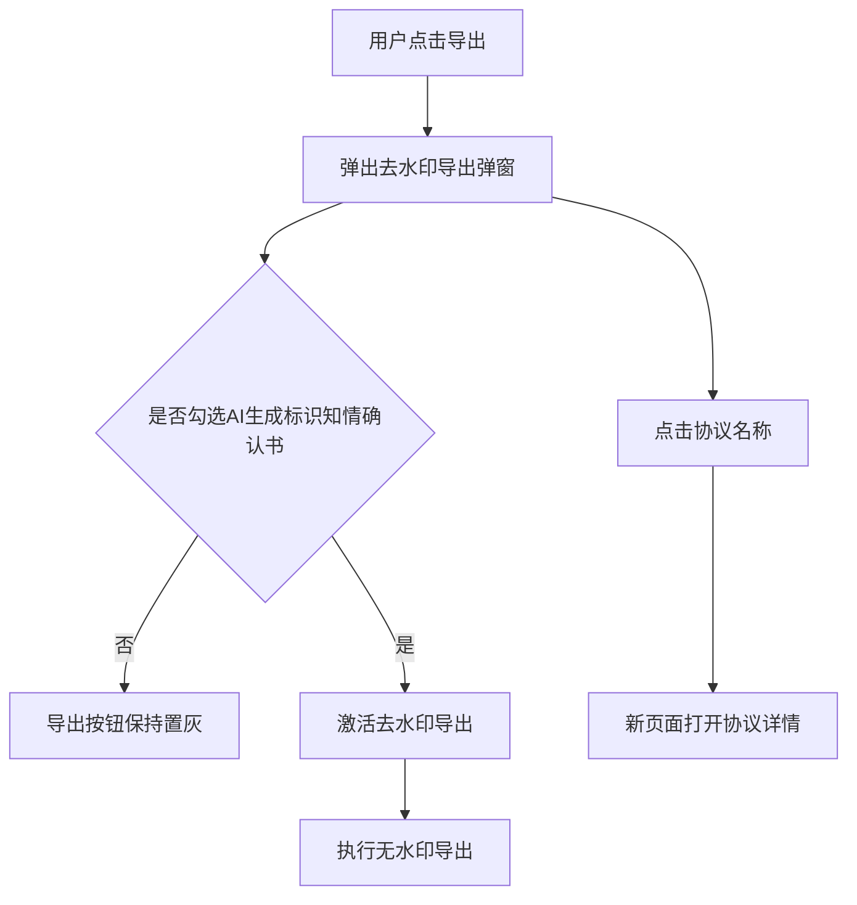

# 核心逻辑_商业化与合规

## 一、文档边界

- 证据来源：
  - `迭代1-迭代6` 原型中的 `积分套餐`、`声音克隆`、`stripe支付`、`去水印`、`（海外）支付接入_onerway` 等页面。
  - `【AI漫剧】使用文档.pdf` 第 15-21 页。
- 口径原则：
  - `当前口径` 优先采用 PDF 和晚期原型。
  - `历史口径` 仅用于还原原型中真实出现过的商业化规则，不等于当前最终定价。
- 风险控制：
  - 不把按钮文案或模糊 UI 文案，直接强行解释成现行计费规则。

## 二、积分体系

### 2.1 当前可确认的积分规则

#### 当前明确消费项

| 业务动作 | 当前口径 | 规则说明 | 来源 |
| --- | --- | --- | --- |
| 创建声音克隆 | `240 积分` | 点击创建后进入等待状态，约 1 分钟左右完成克隆 | PDF 第 21 页 |
| 购买积分有效期 | `当前服务器时间 + 2 年` | 到期后套餐积分清零 | `迭代3/2、积分套餐.html`，`迭代5/4、积分套餐购买.html` |

#### 当前明确业务规则

- 积分购买后立即生效，多次购买可叠加。
- 若积分不足，需要前端拦截，弹出“积分不足，请购买积分”或对应提示。
- 生成失败存在退还积分的业务逻辑，至少在视频生成失败场景被明确标注。

#### 说明

- 现有材料里，当前最硬的数值口径是 `声音克隆 240 积分`。
- 其他计费项在不同迭代中有多版原型口径，下面单独列出，不直接混入当前标准价目表。

### 2.2 历史原型中出现过的显式积分口径

以下条目均为原型明确写出的数值或计费方式，适合保留为“历史规则池”，但不能直接认定为当前线上统一价格。

| 业务动作 | 历史口径 | 规则说明 | 来源 |
| --- | --- | --- | --- |
| 点击“生成动漫” | `10 积分起，最多 30 积分` | 随视频长度变化 | 早期积分原型页 |
| 生成视频 | `按视频长度计费` | 720P：`每秒 8 积分`；1080P：`每秒 40 积分` | 早期积分原型页 |
| 重新生成图片 | `3 积分` | 单次图片重生成扣费 | 早期积分原型页 |
| 重新生成分镜 | `64 积分` | 分镜重生成显式扣费 | 早期积分原型页 |
| 创建声音克隆 | `500 积分` | Web 原型早期口径 | `迭代3/4、声音克隆.html` |
| 克隆音色 | `300 积分` | H5 变体口径 | `迭代3/6、h5-声音克隆.html` |
| 单分镜模式生成视频 | `500` | 按钮直接展示“生成视频（500）” | `迭代6/2、九宫格功能.html` |

#### 历史规则解读

- 早期商业化逻辑更像“按生成动作逐项扣费”。
- 到后期，积分购买、会员、海外支付、音色克隆、单分镜模式逐渐被纳入统一商业体系。
- 但当前材料没有给出“迭代 6 全平台统一积分定价总表”，因此只能把这些数值作为历史快照保存。

### 2.3 积分有效期、记录与赠送

#### 套餐有效期

- 积分套餐有效期统一按 `当前服务器时间 + 2 年` 计算。
- 到期后清零。

#### 积分记录

- 积分明细页记录至少包含：
  - 类型
  - 时间
  - 积分变化值
- 原型中已明确存在：
  - 正向消费记录
  - 失败退还记录
  - 会员赠送记录

#### 会员赠送逻辑

- 早期原型明确描述过会员按月发放积分：
  - 月会员：付款当天先发放当月积分，后续续费再发下一次
  - 年会员：付款当天发第一次，后续按周期共发放 12 次
- 这说明平台商业化不仅是“单买积分”，还包含“会员分期发点”的订阅型设计。

#### 来源依据

- `迭代2/7、积分套餐.html`
- `迭代3/2、积分套餐.html`
- `迭代5/4、积分套餐购买.html`

### 2.4 最新接口表里的扣点状态字段

最新接口表虽然没有给出完整“全平台价目表”，但已经出现了更明确的扣点状态字段，可作为商业化接口层补充口径。

| 接口 | 已确认字段 | 业务含义 | 备注 |
| --- | --- | --- | --- |
| `animatic/multi_model_video` | `points`、`quota_deducted`、`quota_refunded` | 单条分镜视频任务的预计扣点与扣退状态 | 创建任务即返回 |
| `animatic/get_multi_model_video_results` | `user_points` | 任务完成或查询时回传用户当前积分余额 | 长视频多模型链路 |
| `nine_grid/get_multi_model_video_results` | `user_points` | 九宫格视频结果态同样回传用户当前积分余额 | 审核宽松链路 |

#### 当前可确认结论

- 积分是否已扣、是否已退，已经不再只是前端文案或后台隐式逻辑，而是进入任务结果字段层。
- 多模型视频任务的扣点和退点已经细化到单任务粒度。
- 九宫格普通视频任务接口没有单独暴露积分字段，是否完全复用通用视频扣点逻辑，待确认。

### 2.5 最新接口表里的状态与异常承载

- 当前接口表统一保留 `code` + `msg`，但没有提供完整异常码枚举表。
- 多模型视频任务额外使用：
  - `status`
  - `generate_status`
  - `raw_status`
  - `error_data`
- 九宫格视频任务则使用：
  - `generate_status`
  - `error`

#### 现阶段推荐口径

- `code / msg`：接口层是否成功受理
- `status / generate_status / raw_status`：任务层执行状态
- `error / error_data`：失败原因承载字段
- 具体枚举值、异常码和状态迁移图：最新接口表未完整展开，统一标记 `待确认`

## 三、支付路由

### 3.1 支付路由总览

平台已经形成三层支付路由：

- 国内：聚合二维码支付，支持支付宝/微信扫码
- 一般海外：Stripe 托管支付
- 东南亚特定地区：Onerway 默认接管

### 3.2 国内支付逻辑

#### 触发方式

- 用户打开积分购买弹窗。
- 选择套餐后，订单区实时更新：
  - 商品名称
  - 价格
  - 有效期
  - 二维码

#### 支付链路

- 前端在用户进入弹窗或切换套餐时，请求支付二维码链接。
- 二维码支持：
  - 支付宝扫码
  - 微信扫码
- 前端每隔 `2-3 秒` 轮询一次订单支付状态。
- 支付成功后：
  - 弹出“支付成功”提示
  - 关闭弹窗
- 二维码过期后：
  - 二维码区域显示“二维码已失效，请刷新”
  - 用户点击后重新获取二维码

#### 挽回弹窗

- 若用户已打开积分充值弹窗且仍是未支付状态，这时点击右上角关闭按钮，会触发挽留弹窗。
- 分支：
  - `立即支付`：关闭挽留弹窗，但保留底层支付页，方便继续扫码
  - `暂不支付`：同时关闭挽留弹窗和底层积分充值弹窗

#### 来源依据

- `迭代3/2、积分套餐.html`
- `迭代5/4、积分套餐购买.html`

### 3.3 Stripe 支付逻辑

#### 适用场景

- 一般海外支付
- 订阅型会员购买与升级

#### 主流程

- 用户进入 Pricing 页面。
- 使用 `Monthly / Yearly` 切换查看价格。
- 点击 `Subscribe` 或 `Upgrade`。
- 系统调用后端接口创建订单。
- 用户跳转至 Stripe 托管支付页，输入卡号完成支付。
- 支付成功后，跳回平台成功页，并开通对应会员权益。

#### 续费与升级

- 续费：
  - 用户点击同档会员按钮，直接购买
- 升级档位：
  - Stripe 负责差价折算
  - 平台弹出二次确认弹窗
  - 页面展示“今日应付金额”

#### 来源依据

- `迭代3/9、stripe支付.html`
- `迭代3/2、积分套餐.html`
- `迭代5/4、积分套餐购买.html`

### 3.4 Onerway 支付逻辑

#### 触发条件

- 系统通过用户访问 IP 自动识别物理地理位置。
- 生效地区共 `6` 个东南亚国家：
  - 印尼
  - 菲律宾
  - 马来西亚
  - 新加坡
  - 越南
  - 泰国

#### 展示与默认选中

- 若识别为上述地区 IP：
  - 收银台支付方式区域默认勾选 Onerway
  - Logo 区域替换或增加本地支付工具图标
- 若不是上述地区：
  - 保持原有支付方式

#### 跳转逻辑

- 用户点击底部 `Pay Now / 去支付`
- 无需站内二次确认
- 直接重定向至 Onerway 托管收银台

#### 业务含义

- Onerway 不是简单“加一个支付按钮”，而是基于区域识别接管默认支付入口，提高当地转化率。

#### 来源依据

- `迭代6/4、（海外）支付接入_onerway.html`

### 3.5 增长归因与支付事件回传

#### 当前新增接口口径

- `Vinabot` 通用服务层新增 `api/appsflyer/event_track`。
- 该接口通过请求头 `Appsflyer-Id` 承接 AppsFlyer 安装标识。
- 当前明确支持三类事件：
  - `af_complete_registration`
  - `af_purchase`
  - `first_purchase`
- 支付与首次购买事件都要求在 `eventValue` 中传递金额、货币、订单号以及 `platform_type`。

#### 业务含义

- 平台的商业化链路已经不只是“发起支付 -> 跳收银台 -> 回站内”，还开始把注册、支付、首购通过服务端接口回传增长归因系统。
- 这意味着海外投放、注册转化、支付转化和首购转化之间，已经开始形成统一的服务端闭环。

#### 当前边界

- PDF 只明确了请求格式和事件类型，没有提供统一响应体或更完整的归因报表口径。
- 因此本轮文档只确认“已存在增长归因回传接口”，不进一步推断 ROI、投放渠道归因或完整事件字典。

## 四、合规导出

### 4.1 去水印的硬逻辑分支

当前材料明确把“去水印导出”定义为一个强合规校验分支。

#### 硬规则

- 用户点击导出后，出现去水印导出弹窗。
- 弹窗中必须勾选 `《AI生成标识知情确认书》`。
- 导出按钮默认置灰。
- 只有勾选协议后，导出按钮才激活。
- 点击协议名称时，需要在新页面打开协议详情。

#### 当前可确认结论

- PDF 当前口径已明确：
  - 去除官方水印前，必须先完成协议确认
- 原型页进一步把这个逻辑做成了“按钮可用/不可用”的强约束。

#### 不能过度推断的部分

- 现有材料没有把“普通带水印导出”和“无水印导出”两条分支的所有细节完全拆开。
- 因此只能确认：
  - 未勾选协议时，`去水印导出` 不可执行
  - 不能进一步推断所有导出路径都被完全阻断

#### 来源依据

- `迭代5/3、去水印.html`
- `【AI漫剧】使用文档.pdf` 第 16 页

## 五、结论

- 平台商业化已经从早期的“局部扣积分”演进成三层结构：
  - 积分消费
  - 套餐购买
  - 会员订阅与海外支付
- 平台支付路由已经具备地区差异化：
  - 国内走二维码聚合支付
  - 海外走 Stripe
  - 东南亚重点区域走 Onerway 默认接管
- 合规方面，`去水印` 已被定义成必须签署协议后才能放开的硬逻辑分支。
- 当前材料里最稳的现行积分口径是：
  - `声音克隆 240 积分`
  - `积分有效期 2 年`
- 最新接口表已经能追踪视频任务的 `points`、`quota_deducted`、`quota_refunded` 与 `user_points`，说明扣点、退点和余额回传都已经进入接口层。
- `Vinabot` 通用服务层又补出 `api/appsflyer/event_track`，说明注册、支付、首购这些商业化关键行为也开始进入统一的服务端归因链路。
- 其他具体价格更多体现为历史原型快照，适合保留在规则池中，不应直接视为当前线上统一价格表。
- 异常码和状态字段已经开始拆成 `code/msg` 与 `generate_status/error_data` 两层，但完整异常枚举仍待确认。
